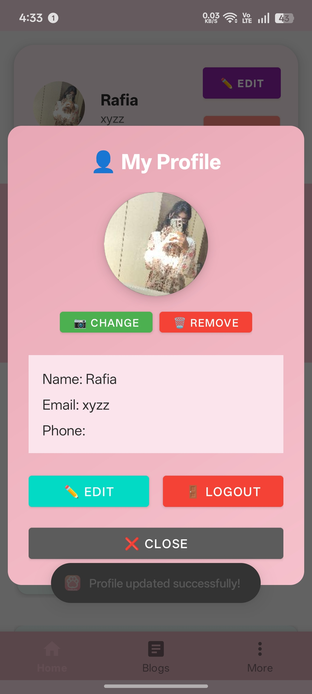
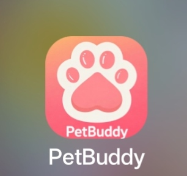

# PetBuddy Android App 🐾

## About
PetBuddy is an Android application designed for pet owners to manage pet services, appointments, and pet care needs easily.

## Features
- User Registration & Login
- Book Pet Services
- Manage Pet Profiles
- View Appointments
- Notifications
- Easy Navigation UI

## Tech Stack
- Java
- Android Studio
- Firebase
- XML Layouts

## My Role
Developed complete Android application including UI design, Firebase integration, authentication, and booking features.

## How to Run
1. Clone repository
2. Open in Android Studio
3. Sync Gradle
4. Run on Emulator / Device

## Future Improvements
- Online Payments
- Chat Support
- Dark Mode
- Better UI

- ## Screenshots

### Splash Screen

### Home Page

### Profile Page

### Blog Section

### More Section

### App Logo

